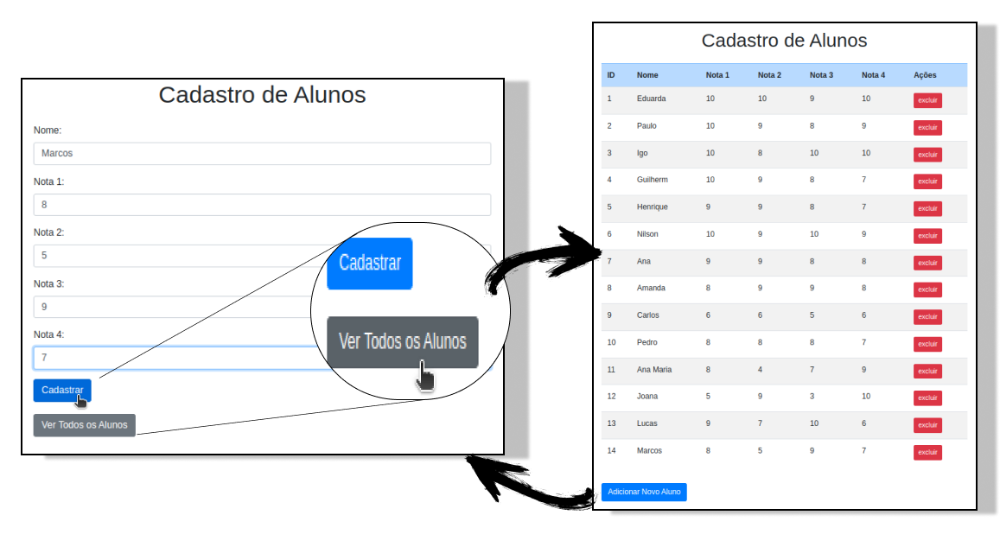

# Cadastro e Gerenciamento de Alunos

## Funcionalidades

- **Cadastro de Alunos**: Permite o registro de novos alunos, incluindo nome e notas em quatro módulos.
- **Visualização de Alunos**: Exibe uma tabela com todos os alunos cadastrados e suas notas.
- **Exclusão de Alunos**: Permite a remoção de registros de alunos existentes.
- **Feedback Visual**: Mensagens de sucesso ou erro são exibidas para confirmar a operação realizada.

## Tecnologias Utilizadas

- **HTML**: Estrutura a página de cadastro e a visualização dos alunos.
- **CSS**: Utiliza o W3.CSS para estilização e melhor apresentação da interface.
- **PHP**: Processa as operações de cadastro, atualização e exclusão de alunos.
- **MySQL**: Armazena os dados dos alunos de forma segura e estruturada.

## Dependências

Certifique-se de que o ambiente esteja configurado corretamente e que todas as dependências necessárias estejam disponíveis.

[Ambiente para rodar PHP](https://github.com/BiancaMalta/PHP/blob/main/README.md)

## Execução 

O projeto segue um fluxo simples, desde a coleta dos dados pelo formulário HTML até o processamento e exibição dos dados pelo PHP. Abaixo está uma visão geral das etapas:

### 1. Formulário HTML

A página `index.php` apresenta um formulário para a inserção de dados dos alunos. Os campos do formulário incluem:
- Nome
- Notas de quatro módulos

Os dados são enviados para o script PHP `actions.php` através do método `POST`.

### 2. Script PHP

Quando o formulário é enviado, os dados são processados pelo `actions.php`. Este script é responsável por:
- **Cadastro de Alunos**: Insere novos registros na tabela `alunoconcluinte`.
- **Atualização de Notas**: Modifica as notas dos alunos existentes.
- **Exclusão de Alunos**: Remove registros de alunos da tabela.

O script PHP utiliza a superglobal `$_POST` para acessar os dados enviados. Após o processamento, redireciona para `index.php` com uma mensagem de sucesso ou erro.

### 3. Processamento dos Dados

- **Recepção dos Dados**: O PHP utiliza `$_POST` para recuperar os dados do formulário, como `$_POST['nome']`, `$_POST['nota1']`, etc.
- **Armazenamento em Variáveis**: Os dados recebidos são armazenados em variáveis para processamento posterior.
- **Validação**: Valida se todos os campos obrigatórios estão preenchidos e se os dados estão no formato correto.
- **Resposta ao Usuário**: Após a operação, o PHP gera uma resposta HTML que confirma a operação realizada e exibe os dados cadastrados.

### 4. Exibição da Resposta

O servidor Apache interpreta o código PHP e envia o resultado de volta ao navegador. A página de `index.php` é atualizada para mostrar a tabela com todos os alunos ou a mensagem de confirmação conforme a ação realizada.

## Autora

---