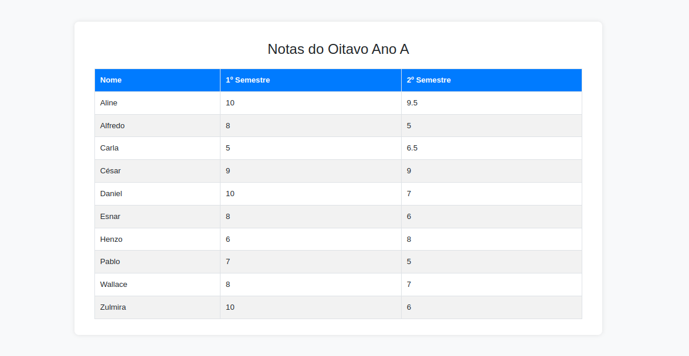

# Gerenciamento de Notas do Oitavo Ano A

## Funcionalidades

- **Exibição das Notas**: Mostra uma tabela com as notas dos alunos do oitavo ano A, incluindo notas do primeiro e segundo semestres.
- **Estilo Moderno**: A tabela é estilizada com cores e estilos modernos para facilitar a leitura e a visualização.
- **Responsividade**: A página é responsiva e se ajusta a diferentes tamanhos de tela, proporcionando uma boa experiência em dispositivos móveis e desktops.

## Tecnologias Utilizadas

- **HTML**: Estrutura a página para exibir a tabela de notas.
- **CSS**: Estiliza a tabela e o layout da página para um design moderno e atraente.
- **Bootstrap**: Utiliza a biblioteca Bootstrap para garantir que a página seja responsiva e visualmente agradável.
- **PHP**: Processa e exibe os dados dos alunos a partir do array bidimensional fornecido.

## Dependências

Certifique-se de que o ambiente esteja configurado corretamente para executar PHP e tenha acesso ao Bootstrap via CDN.

[Ambiente para rodar PHP](https://github.com/BiancaMalta/PHP/blob/main/README.md)

## Execução 

O projeto consiste em uma única página para exibir as notas dos alunos, com os seguintes passos para sua execução:

### 1. Estrutura HTML

O arquivo `index.php` contém o código HTML para exibir a tabela com as notas dos alunos. A estrutura inclui:
- Cabeçalho da tabela com nomes de colunas.
- Linhas da tabela preenchidas com dados dos alunos.

### 2. Estilo CSS

O arquivo `styles.css` define o estilo da página e da tabela:
- **Corpo da Página**: Fundo claro e fontes legíveis.
- **Tabela**: Linhas alternadas em cores cinza claro e branco, com cabeçalho azul.
- **Layout Responsivo**: A página e a tabela são adaptáveis a diferentes tamanhos de tela.

### 3. Script PHP

O código PHP incorporado no `index.php` é responsável por:
- **Processamento dos Dados**: Exibe o array bidimensional com as notas dos alunos em uma tabela HTML.
- **Geração da Tabela**: Cria dinamicamente as linhas da tabela com base nos dados fornecidos.

### 4. Visualização dos Dados

Quando o arquivo `index.php` é acessado, o PHP processa o array e gera a tabela com as notas dos alunos. A página é carregada com a tabela estilizada e pronta para visualização.

## Autora

