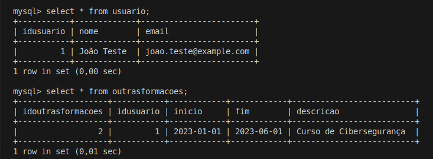

<details>
  <summary>Agenda 11</summary>
  
### Funcionalidades Implementadas

A classe `OutrasFormacoes` representa formações complementares vinculadas a um usuário do sistema, como cursos livres ou certificações extracurriculares.

#### Atributos

* `idoutrasformacoes`: identificador único da formação.
* `idusuario`: ID do usuário ao qual a formação está associada.
* `inicio`: data de início da formação.
* `fim`: data de término.
* `descricao`: descrição da formação realizada.

#### Getters e Setters

Foram implementados métodos de acesso e modificação para cada atributo, permitindo encapsulamento e controle dos dados internos da classe.

#### Método `inserirBD()`

Esse método registra uma nova formação no banco de dados. Ele:

1. Estabelece conexão com o banco usando a classe `ConexaoBD`.
2. Executa um comando `INSERT INTO` na tabela `outrasformacoes`.
3. Se bem-sucedido, atribui ao objeto o ID gerado pelo banco e retorna `TRUE`; caso contrário, retorna `FALSE`.

#### Método `excluirBD($idoutrasformacoes)`

Remove do banco uma formação com base no ID fornecido. Realiza a conexão, executa o `DELETE` e retorna `TRUE` ou `FALSE` conforme o sucesso da operação.

#### Método `listaFormacoes($idusuario)`

Retorna todas as formações vinculadas a um determinado usuário. Realiza um `SELECT` filtrando pelo `idusuario` e devolve o resultado da consulta.

---

#### Teste realizado

Para garantir o funcionamento da classe `OutrasFormacoes`, foi criado um script `teste.php`. Nele, primeiramente foi instanciado um objeto da classe `Usuario`, já que é necessário que o ID do usuário exista no banco para que uma formação possa ser associada a ele.

```php
$testuser = new Usuario();
$testuser->setNome("João Teste");
$testuser->setEmail("joao.teste@example.com");
$testuser->inserirBD();
```

Após inserir o usuário, foi criada uma instância da classe `OutrasFormacoes` com dados fictícios:

```php
$formacao = new OutrasFormacoes();
$formacao->setIdUsuario(1); // ID do usuário criado
$formacao->setInicio('2023-01-01');
$formacao->setFim('2023-06-01');
$formacao->setDescricao('Curso de Cibersegurança');
$formacao->inserirBD();
```
Como resultado, o processo foi validado:



</details>
<details>
  <summary>Agenda 12</summary>

### Funcionalidades Implementadas

1. **Criação de uma nova divisão para "Outras Formações"**:
   Foi adicionada uma nova divisão (`<div>`) dentro do arquivo principal, conforme solicitado, para conter o formulário de inserção de dados e a tabela de exibição.

2. **Formulário de inserção de dados**:
   O formulário contém os seguintes campos:

   * **txtInicioOF**: Um campo de input tipo `date` para que o usuário insira a data de início da formação.
   * **txtFimOF**: Um campo de input tipo `date` para que o usuário insira a data de término da formação.
   * **txtDescEP**: Um campo de input tipo `text` para que o usuário insira uma descrição da formação.
   * **btnAddOF**: Um botão que, ao ser clicado, permite adicionar as informações preenchidas no formulário à tabela abaixo.

3. **Tabela de exibição de formações**:
   A tabela exibe as informações adicionadas pelo usuário nas seguintes colunas:

   * **Início**: Exibe a data de início da formação.
   * **Fim**: Exibe a data de término da formação.
   * **Descrição**: Exibe a descrição fornecida para a formação.
   * **Apagar**: Um botão para remover a linha da tabela (essa funcionalidade pode ser implementada posteriormente).


#### Como Funciona

* O usuário preenche os campos do formulário com as informações de uma nova formação (data de início, data de fim e descrição).
* Ao clicar no botão **Adicionar**, as informações são inseridas na tabela que está logo abaixo do formulário, e cada linha da tabela exibe os dados inseridos.
* As colunas da tabela estão divididas em: **Início**, **Fim**, **Descrição** e **Apagar**.


