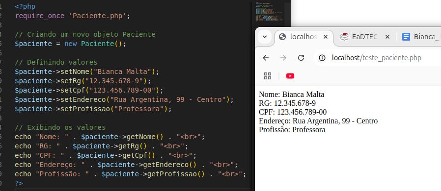

# 🏥 Projeto Hospitalar em PHP - Classe Paciente (POO)



## 🧠 Objetivo

Esta atividade teve como foco a aplicação dos fundamentos da Programação Orientada a Objetos em PHP. A classe `Paciente` foi criada respeitando o encapsulamento e utilizando métodos `get` e `set` conforme o diagrama fornecido.

Além disso, a execução do script demonstrou que os dados do paciente puderam ser manipulados corretamente, o que comprova que a estrutura da classe foi bem implementada e atende ao objetivo da proposta.

Claro! Vou te explicar como os métodos **getters** e **setters** funcionam na prática, de forma clara e aplicada ao seu código da classe `Paciente`. Bora lá:


## 👩‍⚕️ A Classe `Paciente`

Essa classe representa um paciente com **atributos privados**, como `nome`, `rg`, `cpf`, `endereco` e `profissao`.

### ❗ Por que os atributos são `private`?

Porque estamos seguindo o **princípio do encapsulamento** da Programação Orientada a Objetos. Isso quer dizer que **os dados ficam protegidos** e só podem ser acessados de forma controlada — por meio de métodos públicos chamados de **getters e setters**.


## 🛠 O que são e como funcionam os métodos `get` e `set`?

### ✅ Setters (`setAlgumaCoisa`)
Servem para **atribuir um valor** a um atributo da classe.

Exemplo:
```php
public function setNome($nome) {
    $this->nome = $nome;
}
```

Esse método recebe um **parâmetro** (no caso, `$nome`) e o armazena dentro da variável interna `$this->nome`, que pertence ao objeto.

Uso:
```php
$paciente->setNome("Bianca Malta");
```
Aqui, você está dizendo: “Guarde dentro do atributo `nome` do objeto `$paciente` o valor `Bianca Malta`”.


### ✅ Getters (`getAlgumaCoisa`)
Servem para **pegar (retornar)** o valor de um atributo da classe.

Exemplo:
```php
public function getNome() {
    return $this->nome;
}
```

Uso:
```php
echo $paciente->getNome();
```
Esse comando retorna o que está guardado no atributo `nome` daquele objeto. No caso, vai exibir “Bianca Malta”.

---


